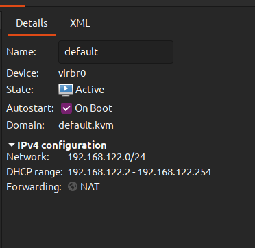

<!-- markdownlint-disable MD033 -->

# libvirt-systemd-resolved

Libvirt hooks for setting up DNS with systemd resolved.

- libvirt uses a separate instance of dnsmasq for each virtual network.
- So if you want full name and reverse lookup for KVM guests on the host,
you can use `systemd-resolved` with libvirt hooks to add per link configs.

## Requirements

- This obviously requires that you use `systemd-resolved` and not other dns resolvers locally.
This is mostly the case with Ubuntu 20.04 and Debian 10.
- You will need libvirt up and running.
- You **MUST** set Domain property in the network configuration. Please note that changes in network config requires network to be destroyed and redefined.

- If using xml, `<domain name="$DOMAIN_NAME"/>` must be used. Example xml for default network,
with domain `default.kvm` is shown below.
  ```xml
  <network>
    <name>default</name>
    <uuid>25009595-68aa-4888-9c74-e3db45818bed</uuid>
    <forward mode='nat'>
      <nat>
        <port start='1024' end='65535'/>
      </nat>
    </forward>
    <bridge name='virbr0' stp='on' delay='0'/>
    <mac address='52:54:00:74:d1:bf'/>
    <domain name='default.kvm'/>
    <ip address='192.168.122.1' netmask='255.255.255.0'>
      <dhcp>
        <range start='192.168.122.2' end='192.168.122.254'/>
        <host mac='52:54:00:DA:4A:4B' name='ansible' ip='192.168.122.129'/>
      </dhcp>
    </ip>
  </network>
  ```

## Installation

```sh
sudo make install
```

## Development

- Sample XMLs used as hook data can be found under fixtures directory.

## PSL Blocking

Known public suffixes are blocked from being configured as routing domains in `systemd-resolved`

```sh
curl -sSfLO https://publicsuffix.org/list/public_suffix_list.dat --output data/public_suffix_list.dat
cat data/public_suffix_list.dat | sed -e '/^*./d;/^[[:space:]]*$/d;/^\\/\\/*/d;/^\!/d;s/^/    \'/;s/$/\',/' | sed -e '1s/^/PSL_DOMAINS = [\n/;$a]' > psldata.py
```
